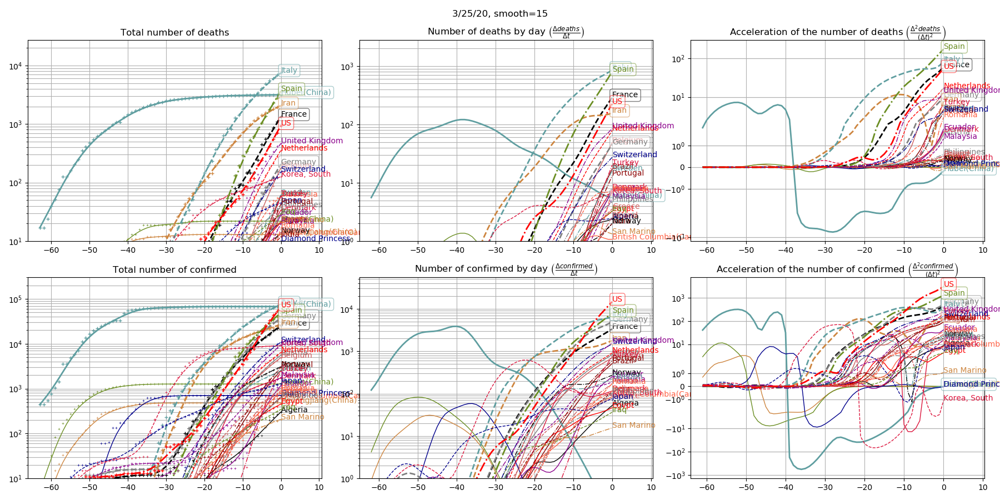
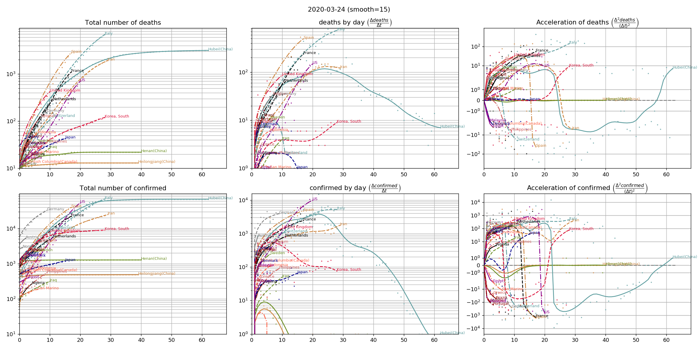

## Number of deaths and confirmed cases (with visual representation of the speed and acceleration)

Based on [data provided by JHU CSSE](https://github.com/CSSEGISandData/COVID-19), one provides groups of 2 by 3 graphs:

- line 1 corresponds to the number of deaths; line 2 to the number of confirmed cases ;
- column 1 gives the figures, column 2 the speed, and column 3 the acceleration ;
- each curve in these graphs corresponds to one country or region, and is a smoothed representation of original data.

### Curves

### Curves synchronized (start when number of deaths >=10 )

### Animation

### Animation synchronized (start when number of deaths >=10 ) 

## From raw data to the above curves (smoothing)

### Curves in time

### Curves synchronized (start when number of deaths >=10 )

