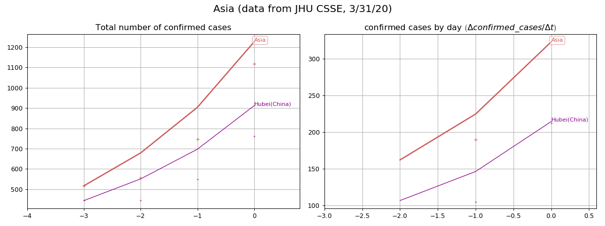

## Graphical representations on the evolution of COVID-19 <a name="top">

This page provides graphical representations of daily-updated [data provided by JHU CSSE](https://github.com/CSSEGISandData/COVID-19).

We consider the evolution of the number of **deaths** and **confirmed cases**. For several groups of countries/regions, we provide

- an animation showing the evolution of the cumulative value and the per-day value 
- a log representation of the evolution of the cumulative value and the growth rate (x(t+1)-x(t))/x(t)
- an estimation of speed and acceleration (first and second order)

- - -

**Table of contents:**

- [Deaths](#d)
  - [World (continents)](#dw)
  - [10 countries with the most deaths](#dt)
  - [Europe](#de)
  - [Asia](#das)
  - [North America](#dna)
  - [South America](#dsa)
  - [Africa](#daf)
- [Confirmed cases](#c)
  - [World (continents)](#cw)
  - [10 countries with the most deaths](#ct)
  - [Europe](#ce)
  - [Asia](#cas)
  - [North America](#cna)
  - [South America](#csa)
  - [Africa](#caf)

- - -

### Deaths <a name="d"> ([top](#top))

- [World (continents)](#dw)
- [10 countries with the most deaths](#dt)
- [Europe](#de)
- [Asia](#das)
- [North America](#dna)
- [South America](#dsa)
- [Africa](#daf)

- - - 

#### World (continents) <a name="dw"> ([top](#top))

- - -

#### 10 countries with the most deaths <a name="dt"> ([top](#top))

- - -

#### Europe <a name="de"> ([top](#top))

- - -

#### Asia <a name="das"> ([top](#top))

- - -

#### North America <a name="dna"> ([top](#top))

- - -

#### South America <a name="dsa"> ([top](#top))

- - -

#### Africa <a name="daf"> ([top](#top))

- - -

### Confirmed cases <a name="c"> ([top](#top))

- [World (continents)](#cw)
- [10 countries with the most deaths](#ct)
- [Europe](#ce)
- [Asia](#cas)
- [North America](#cna)
- [South America](#csa)
- [Africa](#caf)

- - - 

#### World (continents) <a name="cw"> ([top](#top))

- - -

#### 10 countries with the most deaths <a name="ct"> ([top](#top))

- - -

#### Europe <a name="ce"> ([top](#top))

- - -

#### Asia <a name="cas"> ([top](#top))

- - -

#### North America <a name="cna"> ([top](#top))

- - -

#### South America <a name="csa"> ([top](#top))

- - -

#### Africa <a name="caf"> ([top](#top))

- - -
