# Graphical representations on the evolution of COVID-19 <a name="top">

This page provides graphical representations of daily-updated [data provided by JHU CSSE](https://github.com/CSSEGISandData/COVID-19).

We consider the evolution of the number of **deaths**, **confirmed cases** and **recovered cases**. For several groups of countries/regions, we provide

- an animation showing the evolution of the cumulative value and the per-day value 
- a log representation of the evolution of the *cumulative value* and its growth rate (in time, and synchronized)
- a log representation of the evolution of the *per-day value* and its growth rate (in time, and synchronized)

## Table of contents

- [10 most affected countries](#top10)  
- [World](#World)  
- [Europe](#Europe)  
- [Asia](#Asia)  
- [North America](#North_America)  
- [South America](#South_America)  
- [Africa](#Africa)  

- - - 

- - - 

## 10 most affected countries<a name="top10"> ([table of contents](#top))

- [Deaths](#top10d)  
- [Confirmed cases](#top10c)  
- [Recovered cases](#top10r)  

- - - 

### Deaths <a name="top10d"> 

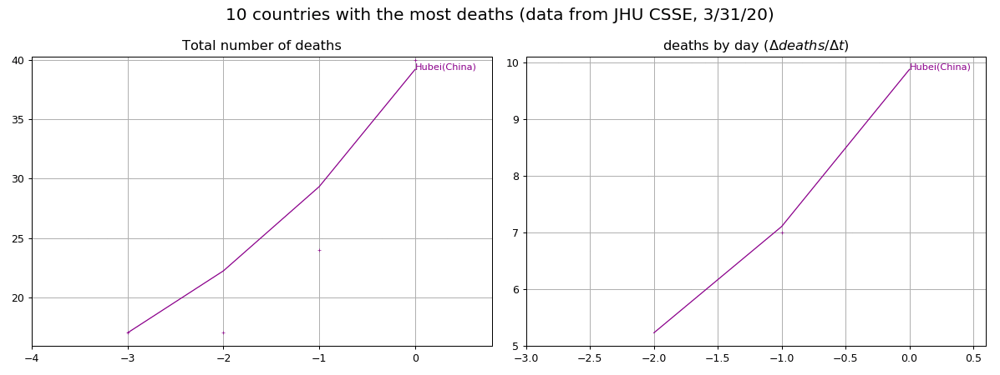

- - - 

### Confirmed cases <a name="top10c"> 

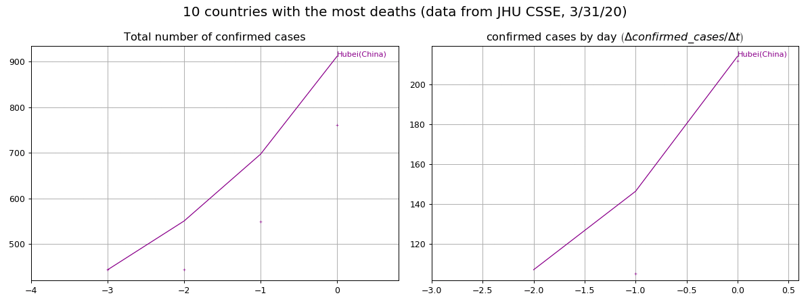

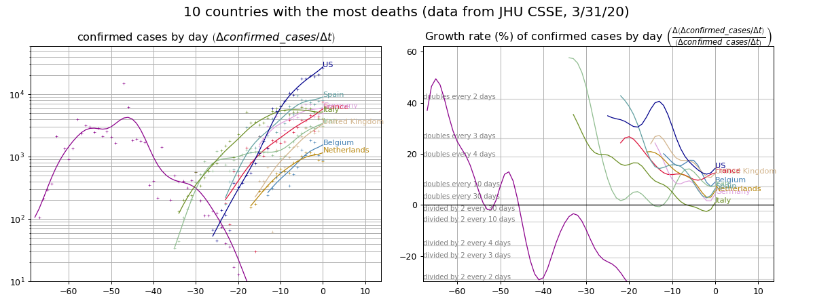

- - - 

### Recovered cases <a name="top10r"> 

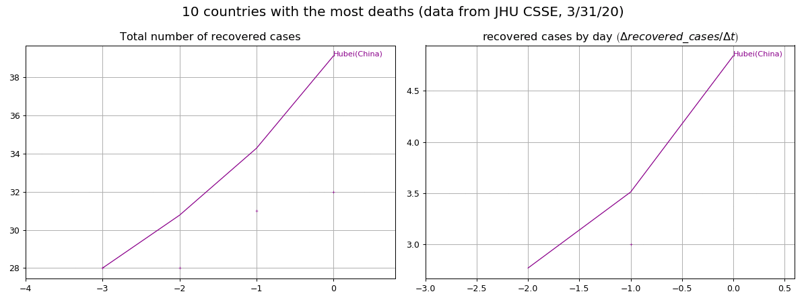

- - - 

- - - 

## World<a name="World"> ([table of contents](#top))

- [Deaths](#Worldd)  
- [Confirmed cases](#Worldc)  
- [Recovered cases](#Worldr)  

- - - 

### Deaths <a name="Worldd"> 

- - - 

### Confirmed cases <a name="Worldc"> 

- - - 

### Recovered cases <a name="Worldr"> 

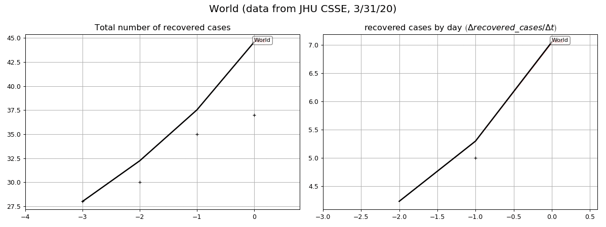

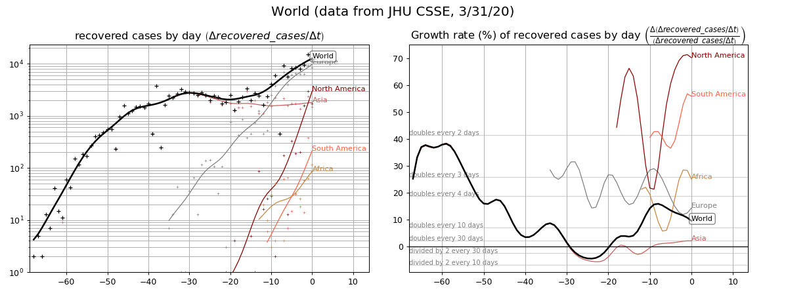

- - - 

- - - 

## Europe<a name="Europe"> ([table of contents](#top))

- [Deaths](#Europed)  
- [Confirmed cases](#Europec)  
- [Recovered cases](#Europer)  

- - - 

### Deaths <a name="Europed"> 

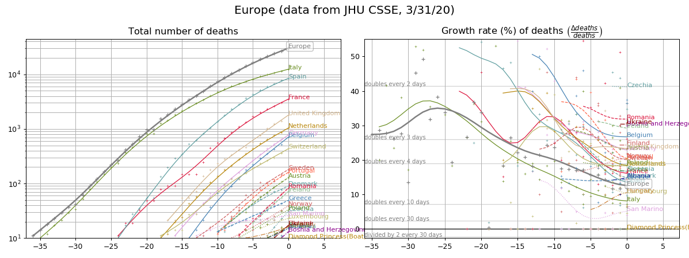

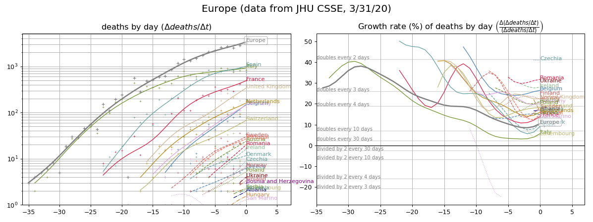

- - - 

### Confirmed cases <a name="Europec"> 

- - - 

### Recovered cases <a name="Europer"> 

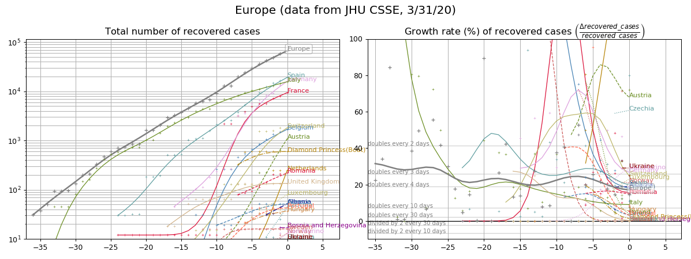

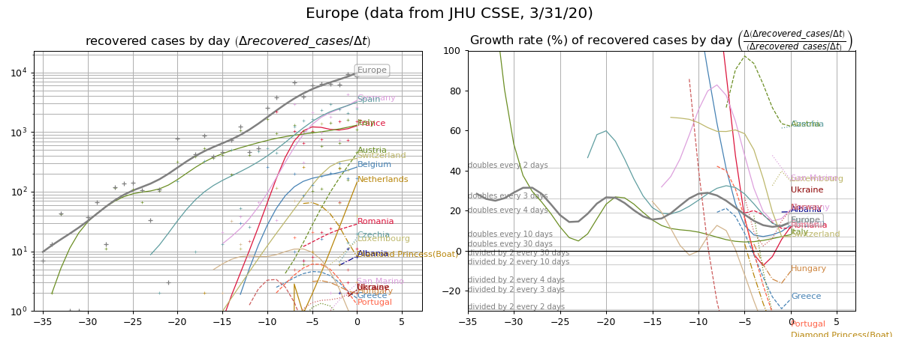

- - - 

- - - 

## Asia<a name="Asia"> ([table of contents](#top))

- [Deaths](#Asiad)  
- [Confirmed cases](#Asiac)  
- [Recovered cases](#Asiar)  

- - - 

### Deaths <a name="Asiad"> 

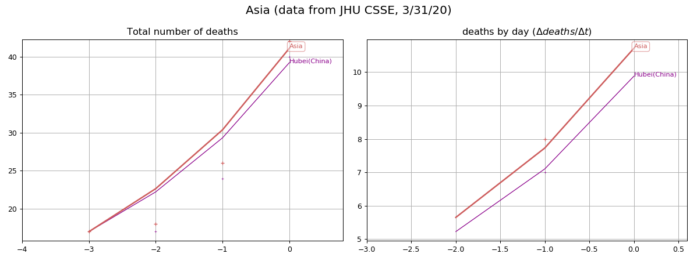

- - - 

### Confirmed cases <a name="Asiac"> 

- - - 

### Recovered cases <a name="Asiar"> 

- - - 

- - - 

## North America<a name="North_America"> ([table of contents](#top))

- [Deaths](#North_Americad)  
- [Confirmed cases](#North_Americac)  
- [Recovered cases](#North_Americar)  

- - - 

### Deaths <a name="North_Americad"> 

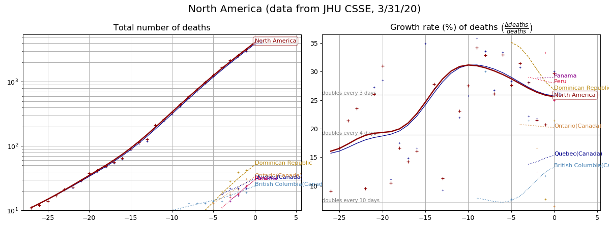

- - - 

### Confirmed cases <a name="North_Americac"> 

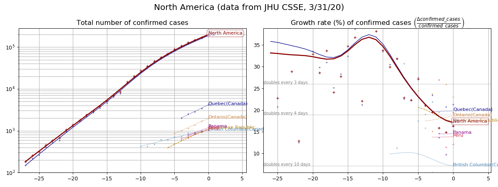

- - - 

### Recovered cases <a name="North_Americar"> 

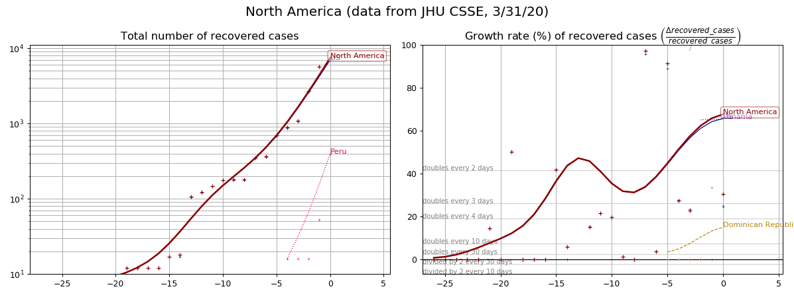

- - - 

- - - 

## South America<a name="South_America"> ([table of contents](#top))

- [Deaths](#South_Americad)  
- [Confirmed cases](#South_Americac)  
- [Recovered cases](#South_Americar)  

- - - 

### Deaths <a name="South_Americad"> 

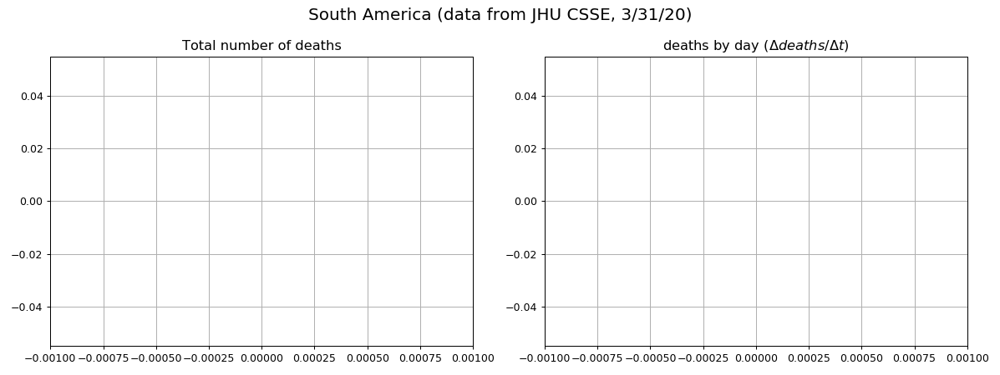

- - - 

### Confirmed cases <a name="South_Americac"> 

- - - 

### Recovered cases <a name="South_Americar"> 

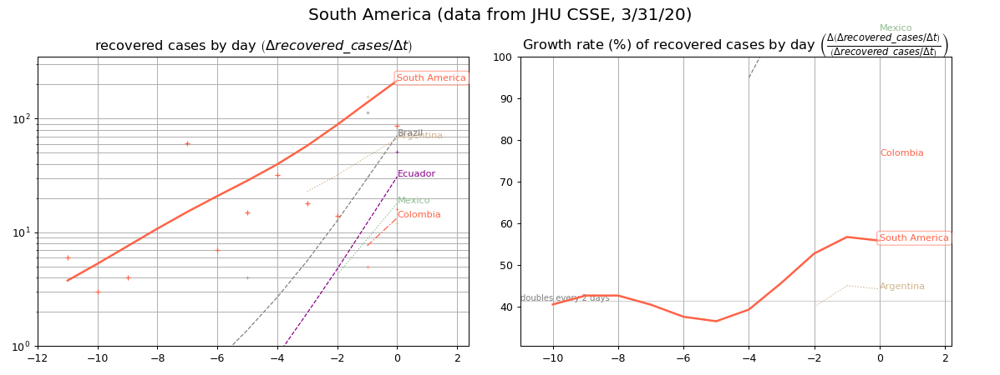

- - - 

- - - 

## Africa<a name="Africa"> ([table of contents](#top))

- [Deaths](#Africad)  
- [Confirmed cases](#Africac)  
- [Recovered cases](#Africar)  

- - - 

### Deaths <a name="Africad"> 

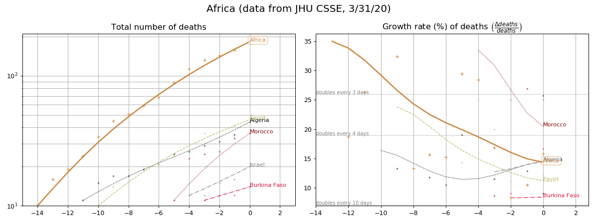

- - - 

### Confirmed cases <a name="Africac"> 

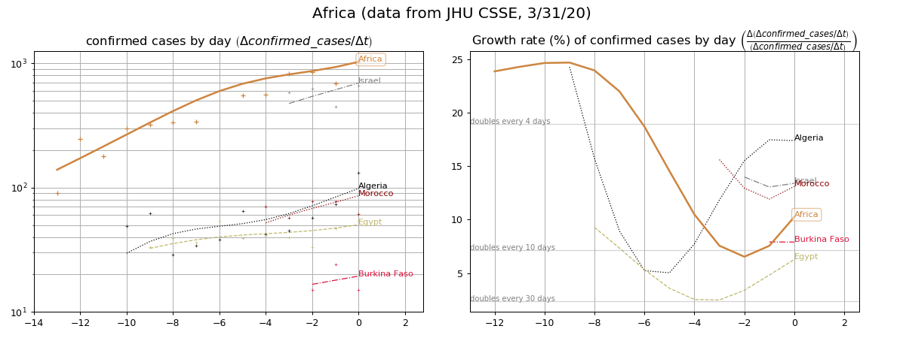

- - - 

### Recovered cases <a name="Africar"> 

- - - 

- - - 

